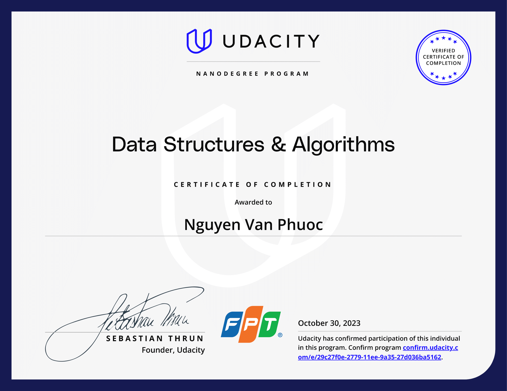

# Data Structures and Algorithms Udacity
## Overview
This program is about how to write code to solve problems and to do so efficiently.

## Welcome
This section covers important foundational topics. Basic Python concepts necessary for understanding will be reviewed, problem-solving strategies will be discussed, and fundamental ideas related to efficiency will be explored.

## Data Structures
When coding to solve problems, data will always be involved. The way data is stored or structured in the computer's memory can significantly impact the possibilities and efficiency of operations. In this section, various data structures will be explored, considering the advantages and disadvantages of using them for different types of problems.

## Basic Algorithms
To solve problems, a precise sequence of steps is required to transform the given input into the desired output. This specific and clear procedure is known as an algorithm. This section introduces some elementary algorithms like binary search and mergesort.

## Advanced Algorithms
In this final segment of the program, we delve into more advanced topics, including greedy algorithms, graph algorithms, dynamic programming, and linear programming.

## Certificate
   

   
    
   <em>Certificate</em>
   

